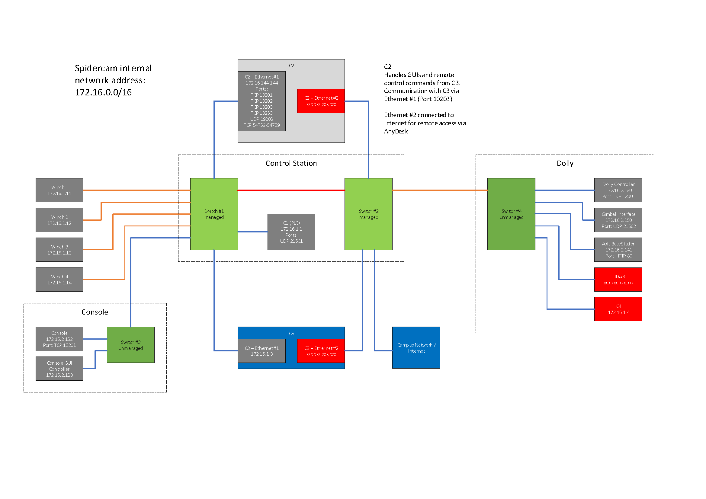

## Project: Ceres is a data acquisition application of the SpiderCam system 

The SpiderCam system is an aerial cable system capable of suspending a sensor dolly ten meters above the field located at the Energy Farm.  The position and height of the dolly is controlled by an industrial PLC labeled C1.  The user interacts or "fly" the system using a dedicated console and Windows based PC (C2) running a middleware and graphical user interface, GUI, applications.  The sensor dolly also contains an industrial computer running Windows (C4).  C4 is connected to the sensors mounted on the dolly.  A separate computer (C3) is used to collect data from C4 via a fiber optic link.

## Overview

* [Cloning project](#Cloning-this-project)
* [Directory Structure](#Directory-Structure)
* [Documentation](#Documentation)
* [Third-party contributions](#third-party-Contributions)
* [Dependencies](#Dependencies)

## Requirements

The Ceres project is implemented in C++.  It is assumed that the target system has a C++ compiler that supports at least the C++17 standard.  The project also using the CMake meta-build system to generate the build files.  As such, many build systems are supported: makefiles, ninja, Xcode, Visual Studio, etc.

CMake can be installed using your package manager or by visiting https://cmake.org

## Cloning this project

To clone this project to your local machine, use the follow command:

    git clone https://github.com/IGBIllinois/Ceres.git

## Directory Structure

### A typical top-level directory layout

    .
    +-- docs                    # Documentation and artwork files
    +-- src                     # Source files for the C++ code
    +-- third_party             # Third party C++ libraries
    +-- README.md

## Documentation

* [Definitions](docs/definitions.md#top)
* [Using CMake](docs/cmake.md#top)
* [Building Third Party Libraries](docs/build_third_party_libs.md#top)
* [Build Instructions](docs/build.md#top)

## Third-party Contributions

The follow support libraries are hosted on GitHub:

* The command line parser library comes from the catchorg/Clara project
* The json parser library comes from the nlohmann/json project
* The Catch2 testing library comes from the catchorg/Catch2 project

Please see the "Building third party libraries".

## Dependencies

